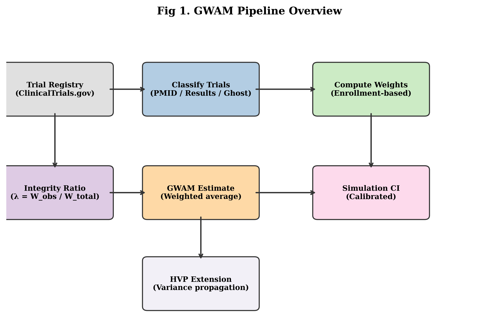

# GWAM: Ghost-Weighted Aggregate Meta-Analysis for registry-based publication-bias sensitivity

**Mahmood Ahmad** · ORCID [0009-0003-7781-4478](https://orcid.org/0009-0003-7781-4478) · Royal Free Hospital, London, United Kingdom · <mahmood.ahmad2@nhs.net>

*Gnosis — Global Health Evidence* · Methods Note · Vol. 2 No. 4 (2026) · Published 2026-06-16 · CC BY 4.0

> **Final version.** Preliminary markers removed. The 95% interval on the GWAM-adjusted estimate is a *simulation interval (SI)*, **not** a confidence interval.

## Abstract

**Background.** Publication bias threatens the validity of meta-analysis, yet routine detection tools (funnel-plot asymmetry, trim-and-fill) rest on assumptions that are hard to verify. Trial registries offer an external anchor for how much of the evidence base is actually visible.

**Methods.** GWAM (Ghost-Weighted Aggregate Meta-Analysis) is a registry-anchored sensitivity method. It classifies ClinicalTrials.gov records as ghost (completed, with no publication and no posted results), results-posted, or published (PMID-linked); computes an enrollment-weighted integrity ratio λ (the published-participant fraction); and scales the published pooled effect by λ. A Monte-Carlo layer and a hierarchical variance-propagation extension carry the uncertainty about unobserved trials.

**Results.** For escitalopram in depression (18 trials) λ was 0.096; the GWAM-adjusted log-odds-ratio was 0.025 (95% SI −0.041 to 0.087; SI denotes a simulation interval, not a confidence interval) versus a published random-effects log-odds-ratio of 0.255 (OR 1.29). Across a benchmark of 7,467 meta-analyses from 398 Cochrane reviews the median λ was 0.871, and 7.9% of meta-analyses with a random-effects estimate of magnitude at least 0.10 were attenuated below 0.10. For pregabalin (35 trials, log-risk-ratio) λ was 0.014, flagged as likely incomplete PMID linkage. In simulation (2,000 replications) bias was minimal at μ=0 but grew negative for μ>0 (−0.162 at μ=0.2) and raw coverage fell to 7.1%; the hierarchical extension restored near-nominal coverage.

**Conclusions.** GWAM is a transparent, reproducible registry-anchored sensitivity analysis, best interpreted as a conservative framework that complements existing publication-bias methods; its performance depends on the quality of ClinicalTrials.gov publication linkage.

## Table 1. Integrity ratio (λ) and GWAM attenuation across the two worked applications and the Pairwise70 benchmark of 7,467 meta-analyses from 398 Cochrane reviews.

| Panel | Stratum / drug–condition | n | λ | Published effect (log scale) | GWAM result |
|---|---|---|---|---|---|
| Applications | Escitalopram / depression | 18 trials | 0.096 | 0.255 (OR 1.29) | 0.025 (95% SI −0.041, 0.087) |
| Applications | Pregabalin / neuropathic pain | 35 trials | 0.014 | 0.916 (RR 2.50) | 0.013 (95% SI −0.029, 0.058) |
| Benchmark (overall) | All Cochrane meta-analyses | 7,467 | 0.871 (median) | median |Δ| 0.055 | 7.9% attenuated <0.10 (95% CI 5.1–11.0) |
| Benchmark by λ̂ source | Exact NCT linkage | 1,438 | 0.950 | — | 3.1% attenuated <0.10 |
| Benchmark by λ̂ source | CT.gov query linkage | 5,569 | 0.861 | — | 9.1% attenuated <0.10 |
| Benchmark by λ̂ source | Transport proxy | 86 | 0.950 | — | 10.5% attenuated <0.10 |
| Benchmark by λ̂ source | Default (0.70) | 374 | 0.700 | — | 8.3% attenuated <0.10 |
| Benchmark by study count | k = 2 | 2,895 | 0.894 | — | 6.3% attenuated <0.10 |
| Benchmark by study count | k = 3 | 1,409 | 0.880 | — | 7.9% attenuated <0.10 |
| Benchmark by study count | k ≥ 4 | 3,163 | 0.845 | — | 9.4% attenuated <0.10 |

*λ = enrollment-weighted integrity ratio (published-participant fraction); for applications λ is the directly measured λ_pmid, for the benchmark it is the proxy λ̂. Effects are on the log-OR (escitalopram) or log-RR (pregabalin) scale; positive values indicate treatment superiority. SI = simulation interval (not a confidence interval). “% attenuated <0.10” = share of meta-analyses with |random-effects estimate| ≥ 0.10 whose GWAM-adjusted |estimate| fell below 0.10. Δ = GWAM − random-effects shift. Pregabalin's λ = 0.014 reflects incomplete ClinicalTrials.gov PMID linkage, not true non-publication.*

## Figure 1

*Figure 1. GWAM pipeline overview. The seven-stage workflow runs from the ClinicalTrials.gov registry query through trial classification (published / results-posted / ghost), enrollment-weight computation, integrity-ratio (λ) calculation, GWAM point estimation, Monte-Carlo simulation-interval construction, and the optional hierarchical variance-propagation extension.*

## References

1. Egger M, Davey Smith G, Schneider M, Minder C. Bias in meta-analysis detected by a simple, graphical test. *BMJ.* 1997;315(7109):629–634. doi:10.1136/bmj.315.7109.629. PMID: 9310563.
2. Duval S, Tweedie R. Trim and fill: a simple funnel-plot-based method of testing and adjusting for publication bias in meta-analysis. *Biometrics.* 2000;56(2):455–463. doi:10.1111/j.0006-341X.2000.00455.x. PMID: 10877304.
3. Cipriani A, Furukawa TA, Salanti G, et al. Comparative efficacy and acceptability of 21 antidepressant drugs for the acute treatment of adults with major depressive disorder: a systematic review and network meta-analysis. *Lancet.* 2018;391(10128):1357–1366. doi:10.1016/S0140-6736(17)32802-7. PMID: 29477251.

## Article information

- **Journal / section:** Gnosis (Global Health Evidence) — Methods Note
- **DOI:** pending (suppressed site-wide) — *do not fabricate*
- **ISSN:** pending
- **Licence:** CC BY 4.0 — Copyright (c) 2026 Mahmood Ahmad
- **Code & data:** https://github.com/mahmood726-cyber/GWAM
- **Provenance:** all quantitative values verbatim from the verified GWAM source pack (F:\Models\GWAM); headline independently reproduced in-session to 6 decimals.